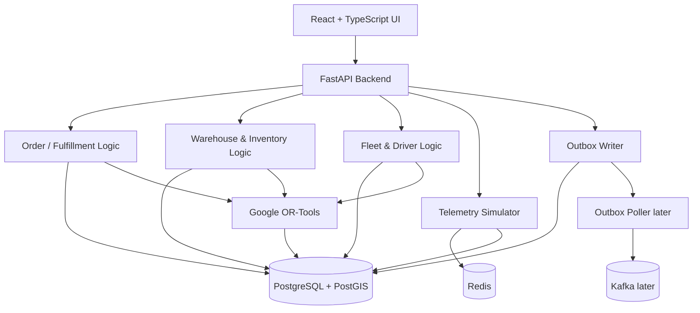
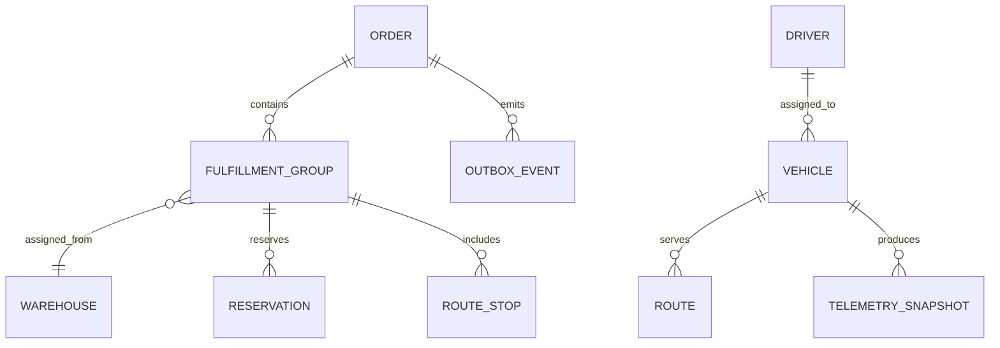
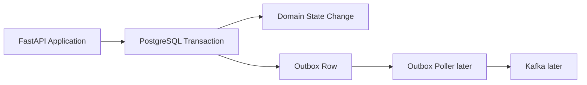

# RouteGrid Architecture

## 1. Architecture Overview

RouteGrid is a real-time urban logistics optimization and delivery management platform for a real city geography represented by a synthetic operational dataset. The system manages customer orders, warehouse selection, inventory reservations, joint vehicle assignment and route sequencing, simulated vehicle tracking, and disruption recovery.

RouteGrid v1 is a modular monolith. All backend domain logic runs inside one FastAPI application and one deployable backend process. The backend is separated into logical modules so that responsibilities remain clear, but those modules are not separate services. This is the correct shape for v1 because the product needs strong transactional consistency across orders, inventory, routing, and events before any microservice boundary is justified.

The main components are:
- React + TypeScript frontend for dispatcher/operator workflows.
- FastAPI backend for HTTP APIs and application orchestration.
- PostgreSQL + PostGIS for persistence, geospatial data, and transactional durability.
- Redis for current vehicle-location caching and fast read access.
- Google OR-Tools for joint allocation and route optimization.
- PostgreSQL outbox tables for durable event capture from day one.
- Kafka later, introduced only as the publication transport for already-written outbox rows.

The architecture emphasizes a clean separation of concerns without premature distribution. In v1, the system should be easy to explain, test, and evolve. Later capabilities can be added by extracting responsibilities from the monolith only when operational or scaling pressure makes that worthwhile.



## 2. Why a Modular Monolith Fits v1

RouteGrid needs tight consistency between several operations that are naturally coupled:
- an order can split across warehouses,
- reservations must prevent overselling,
- route allocation must respect vehicle capacity,
- telemetry must reflect assigned routes,
- disruptions must trigger reassignment and status changes,
- state changes must be recorded transactionally in the outbox.

These concerns are easier and safer to implement inside one application than across multiple services. A modular monolith reduces coordination overhead, avoids distributed transaction complexity, and makes the system easier for a student developer to reason about in interviews.

The design is intentionally not a microservices starter kit. The internal module boundaries exist so the code can be separated by concern, tested in isolation, and later extracted if the project grows enough to justify it.

## 3. System Context and Request Flow

The request path in v1 is straightforward:
1. The frontend sends an operator action or dashboard query to the FastAPI backend.
2. The backend routes the request to the appropriate application service.
3. The service coordinates domain rules, persistence, and optimization.
4. PostgreSQL remains the source of truth for transactional state.
5. Redis holds the current vehicle position for fast reads.
6. OR-Tools is invoked for batch assignment and route sequencing when pending work must be allocated or re-optimized.
7. Each meaningful state change writes an outbox event in the same transaction.

The backend does not depend on Kafka for v1 business flow. The outbox table is sufficient until a later milestone introduces a poller and a broker.

## 4. Backend Logical Modules

The backend package is organized as one application with logical modules:

### 4.1 `api/`
The HTTP boundary. It receives requests, validates input, calls services, and returns response models. This layer should stay thin and avoid business logic.

### 4.2 `api/routes/`
Endpoint modules grouped by domain area. Each route module maps one set of HTTP concerns to the service layer.

### 4.3 `core/`
Shared application concerns such as configuration, dependency seams, the current-user placeholder, and cross-cutting helpers.

### 4.4 `db/`
Database session setup, engine configuration, migration integration, and persistence wiring.

### 4.5 `models/`
SQLAlchemy persistence models representing the stored domain state.

### 4.6 `schemas/`
Pydantic request and response models used at the API boundary.

### 4.7 `services/`
Domain orchestration and business rules. This is where most application behavior lives.

### 4.8 `repositories/`
Persistence abstractions that keep SQLAlchemy and query details out of services when that separation is helpful.

### 4.9 `events/`
Domain event definitions, outbox writing support, and event-related application logic.

### 4.10 `optimization/`
Route allocation and vehicle-routing integration with Google OR-Tools.

### 4.11 `simulation/`
In-process telemetry generation, simulated-time progression, and current-position updates.

## 5. Frontend Architecture

The frontend is a separate application that consumes backend APIs and presents operational state to dispatch users.

### 5.1 `src/components/`
Reusable UI components such as panels, tables, status badges, filters, and map overlays.

### 5.2 `src/pages/`
Page-level screens for operational workflows such as dashboard views, order review, allocation review, and vehicle status.

### 5.3 `src/layouts/`
Shared page shells and navigation layouts.

### 5.4 `src/hooks/`
Reusable React hooks for data fetching, UI state, and map interactions.

### 5.5 `src/services/`
API client code and request helpers.

### 5.6 `src/types/`
Frontend domain types mirroring backend response shapes.

### 5.7 `src/utils/`
Pure helper functions.

### 5.8 `src/lib/`
Third-party configuration and shared library setup.

The frontend stack is React, TypeScript, Vite, Tailwind CSS, Leaflet, OpenStreetMap tiles, and Recharts. The UI should be operationally dense rather than decorative, because the primary users are dispatch operators.

## 6. Data and Persistence Architecture

PostgreSQL is the system of record. PostGIS supports the geographic data model, warehouse locations, customer locations, and distance calculations based on the configured approximation.

The persistence model in v1 must support:
- orders and fulfillment groups,
- warehouses and inventory,
- reservations and reservation release,
- vehicles and drivers,
- routes and route stops,
- telemetry snapshots,
- outbox events,
- disruption and reassignment history.

The database is the source of truth for durable application state. Redis stores only current vehicle-location data for fast reads; it does not replace PostgreSQL history or transactional state.



## 7. Order, Inventory, and Allocation Flow

Orders are not the leaf delivery unit. A single order can split into multiple fulfillment groups when multiple warehouses are needed or when partial fulfillment is operationally preferable.

The flow is:
1. An order is created.
2. The system determines candidate warehouses using hard constraints first.
3. The warehouse-selection heuristic scores viable candidates using distance, workload, and estimated delivery time.
4. Inventory reservations are created for the selected fulfillment groups.
5. The fulfillment groups enter the batch allocation queue.
6. The next batch solve assigns vehicles and route sequences jointly.
7. The order status is derived from the fulfillment-group states.

This separation matters. Warehouse selection happens before route optimization, while vehicle assignment and stop sequencing happen together inside OR-Tools. That distinction keeps the architecture aligned with the finalized requirements.

## 8. Optimization and Dispatch Architecture

RouteGrid uses Google OR-Tools for the vehicle-routing decision in v1. The solver takes a batch of pending fulfillment groups and available vehicles and solves the assignment and stop order together.

The optimization pipeline is:
1. Collect pending orders and reassignable fulfillment groups.
2. Filter out unavailable warehouses and vehicles.
3. Prepare the capacity, distance, and route constraints.
4. Run OR-Tools on the batch.
5. Persist the resulting vehicle assignments and route order.
6. Emit outbox events for the changes.

The batch trigger is an application rule, not a separate service. In v1, a new order waits in `PENDING_ALLOCATION` until the batch policy fires. That behavior is deliberate because the solver is making a joint decision over multiple orders and vehicles, not a greedy immediate assignment.

```mermaid
sequenceDiagram
	participant UI as Dispatcher UI
	participant API as FastAPI
	participant SVC as Allocation Service
	participant OPT as OR-Tools
	participant DB as PostgreSQL

	UI->>API: Create order / review queue
	API->>SVC: Persist pending order
	SVC->>DB: Save order + outbox event
	Note over SVC: Order remains PENDING_ALLOCATION
	SVC->>OPT: Batch solve on trigger
	OPT-->>SVC: Vehicle assignments + stop order
	SVC->>DB: Persist routes, assignments, status updates
	SVC->>DB: Write outbox events in same transaction
```

## 9. Real-Time Tracking and Simulation

RouteGrid does not integrate with real GPS hardware in v1. Instead, an in-process simulator advances vehicle positions along the assigned route using compressed simulated time.

The simulation architecture is:
- the simulator reads the assigned route,
- it interpolates the next position along the path,
- it writes the current position to Redis,
- it periodically persists snapshots to PostgreSQL,
- the frontend reads the latest position from the backend.

This design gives the product a believable operational feel without pretending to ingest real telematics. It also keeps the implementation explainable and locally testable.

Redis stores the fast-moving current state because it is read frequently and changes often. PostgreSQL stores the historical record so telemetry can be reviewed, audited, and replayed.

## 10. Failure Handling and Re-optimization

Failures are first-class in RouteGrid v1. A vehicle may break down, and a warehouse may become non-operational. The system should not hide the recalculation step.

When a vehicle breaks down:
1. the affected stops are identified,
2. those stops are returned to the pending or reassignable pool,
3. the system gathers a sub-batch of affected work,
4. remaining available vehicles are re-evaluated,
5. OR-Tools runs a new solve,
6. updated assignments and ETAs are persisted,
7. operator-facing state updates to show the recalculating period.

This is intentionally not an instant one-off reassignment. The delay is part of the honest system behavior.

## 11. Event and Outbox Architecture

RouteGrid uses the PostgreSQL outbox pattern from day one. Every meaningful state change writes an outbox event in the same transaction as the business-state update. This avoids the dual-write problem and ensures events cannot get out of sync with the database state.

In v1, the outbox is the durable audit and integration boundary. No Kafka consumer is required yet. When Kafka is introduced later, a poller can read unpublished outbox rows and publish them without changing the code that creates the events.



## 12. Authentication Seam

Full JWT authentication and RBAC are deferred, but the architecture must include a `get_current_user`-style seam from the start. That seam should be threaded through the API and service boundaries so real auth can be swapped in later without changing endpoint signatures or the broader application shape.

For v1, the seam can return a hardcoded development user. The important part is that the dependency exists now, because later auth work should replace an implementation detail rather than force a redesign.

## 13. Testing Architecture

Pytest is the main test framework for backend unit and integration tests. The test structure should mirror the logical backend modules so that each concern can be validated separately.

Locust is reserved for later load testing. It is not part of the first implementation milestone, and its presence should not be treated as a requirement for the v1 functional model.

The testing strategy should focus on:
- domain rules,
- allocation behavior,
- reservation correctness,
- outbox writes,
- re-optimization after disruption,
- telemetry simulation consistency.

## 14. Deployment and Evolution Path

v1 remains a modular monolith deployed as one backend application plus one frontend application. Docker, cloud deployment, and scaling concerns are deferred until there is something real to deploy and scale.

The likely evolution path is:
1. modular monolith with transactional persistence,
2. optional outbox polling to Kafka later,
3. targeted extraction of read-heavy or compute-heavy concerns only if needed,
4. cloud deployment once the system has a stable operational model.

The key rule is that evolution should be driven by actual need, not by architectural fashion.

## 15. Summary

RouteGrid v1 is a carefully bounded modular monolith built around a real operational workflow: orders, warehouses, inventory reservations, batch optimization, simulated telemetry, and disruption recovery. The architecture deliberately prioritizes correctness, explainability, and strong internal boundaries over early distribution.

That makes it a good fit for a student project that still needs to be technically defensible. It is realistic enough to demonstrate real logistics thinking, but small enough to remain understandable end to end.
